# 👨‍🍳 Chef AI  


---

**Chef AI** is a **beautiful AI-powered recipe app** built with **Flutter**, offering a smart way to discover and create recipes.  
Browse recipes from an API, **generate new recipes using AI (Spoonacular)** by providing ingredients, and enjoy a clean and modern UI with **light & dark mode support**.

---

## ✨ Features
- 🔐 **Authentication** (Sign In / Sign Up)  
- 🍲 **Fetch Recipes** from a public API  
- 🤖 **AI Recipe Generator** – Create recipes based on your ingredients  
- 💾 **Save Favorite Recipes** locally  
- 🌗 **Light & Dark Mode** for better UX  
- 🔔 **Notifications** for reminders and updates  
- ⚙️ **Settings Screen** for customization  
- 🧭 **Navigation using `go_router`**  
- 🏗 **State Management using BLoC** for scalability  

---

## 🛠 Tech Stack
- **Flutter (Dart)**
- **BLoC** – State Management
- **go_router** – Modern Navigation
- **Spoonacular API + AI** – Recipe fetching & generation
- **HTTP** – Network calls
- **Responsive UI** – Supports multiple devices

---

## 📱 Screenshots

<details>
<summary>🌙 Dark Mode</summary>

### 🔐 Auth Screens
<p>
  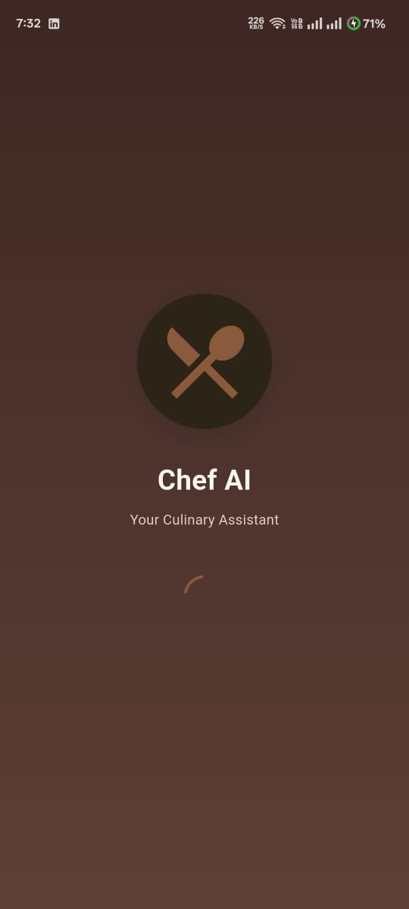
  
  
  
</p>

### 🍲 Recipe Screens
<p>
  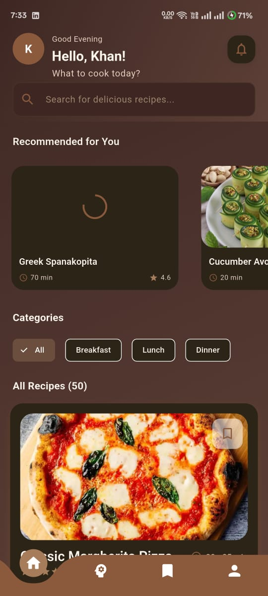
  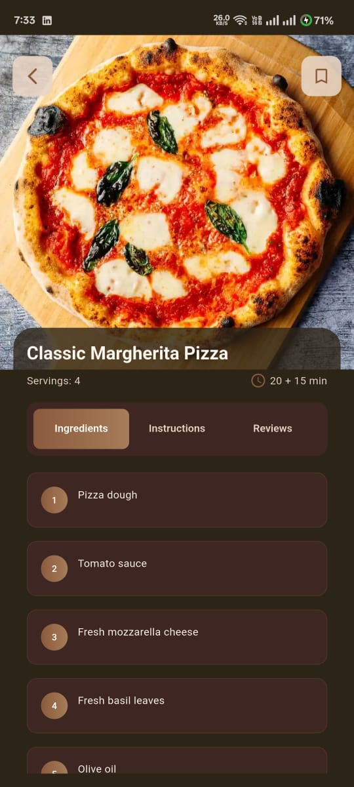
  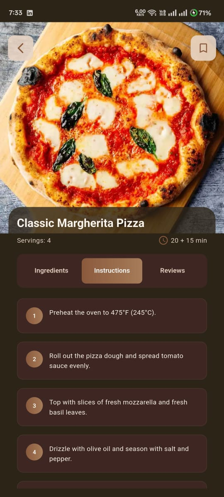
  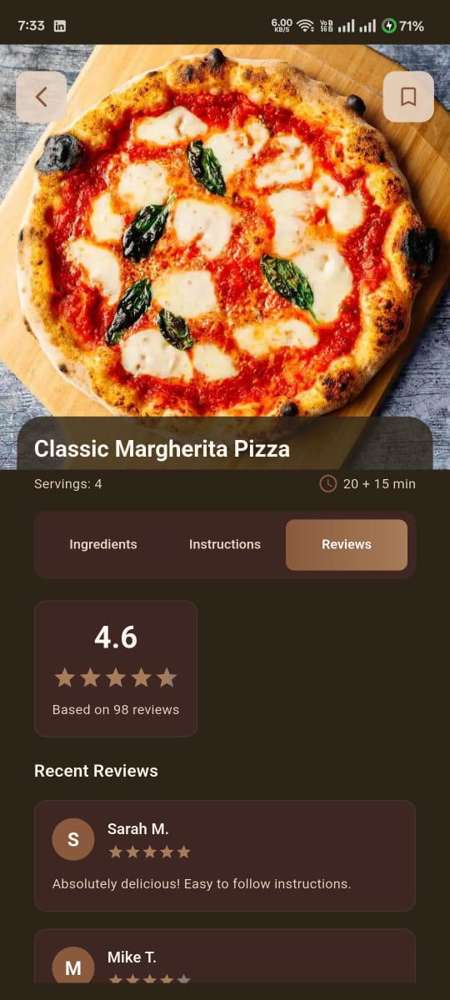
  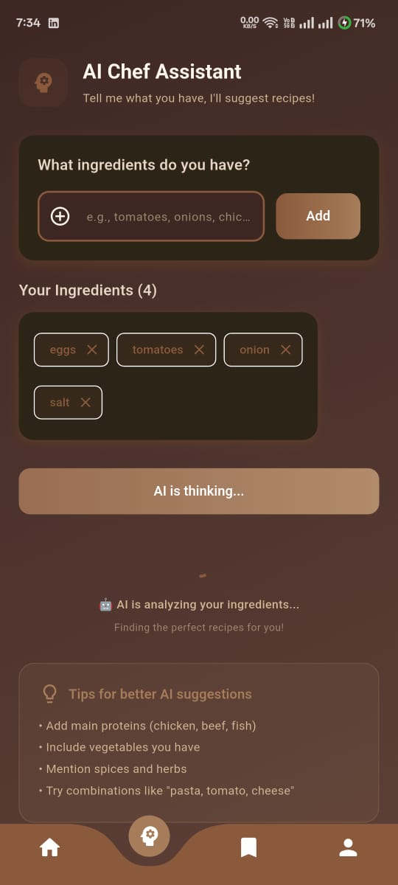
</p>

### 🤖 AI Assistant Screen
<p>
  
  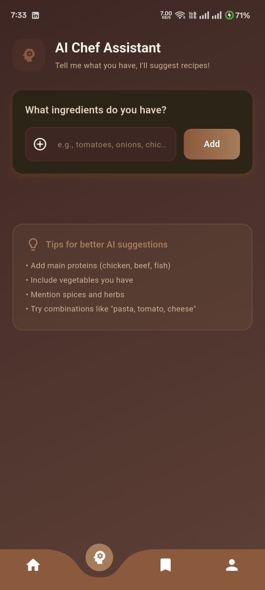
  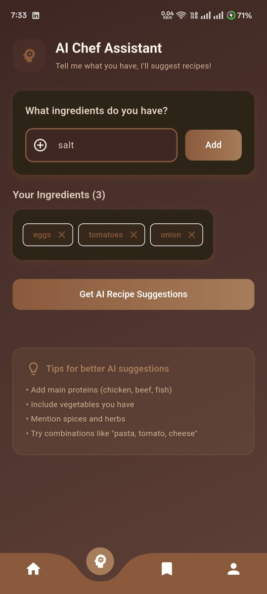
  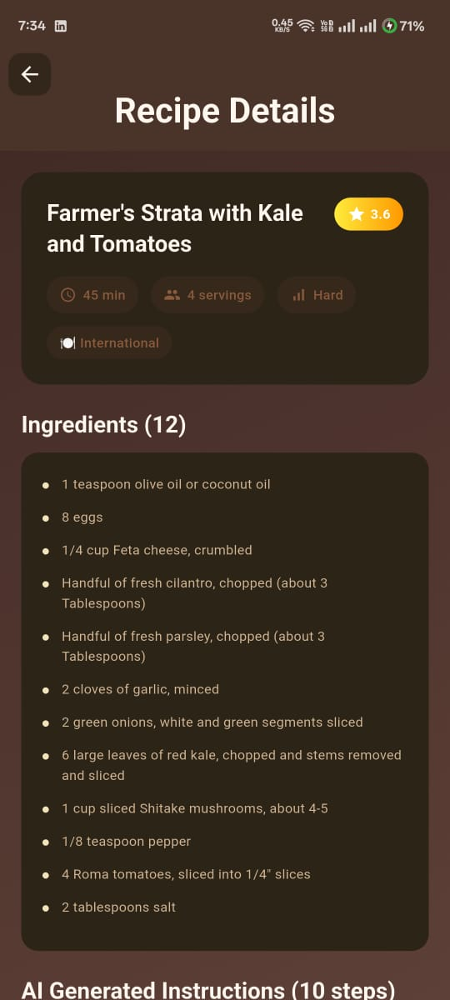
  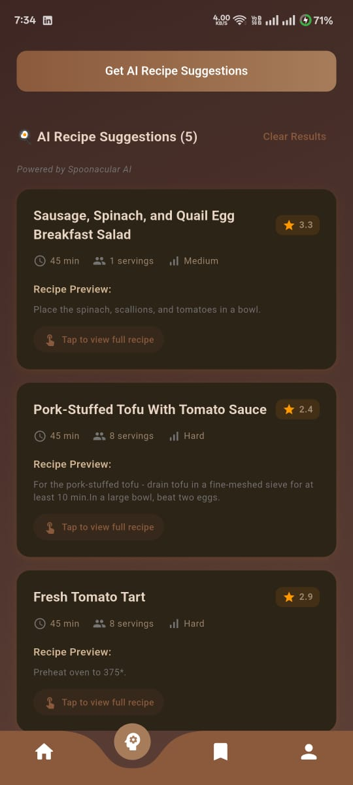
  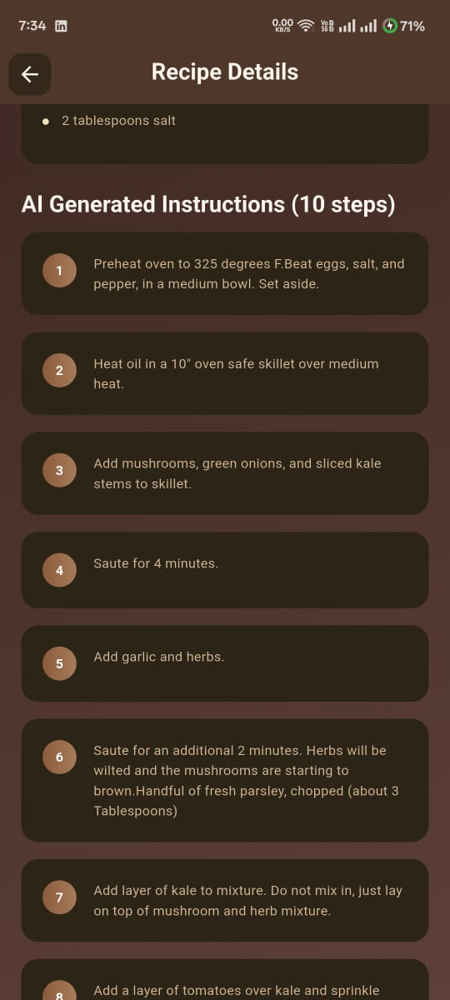
</p>

### 💾 Saved Recipes & Settings
<p>
  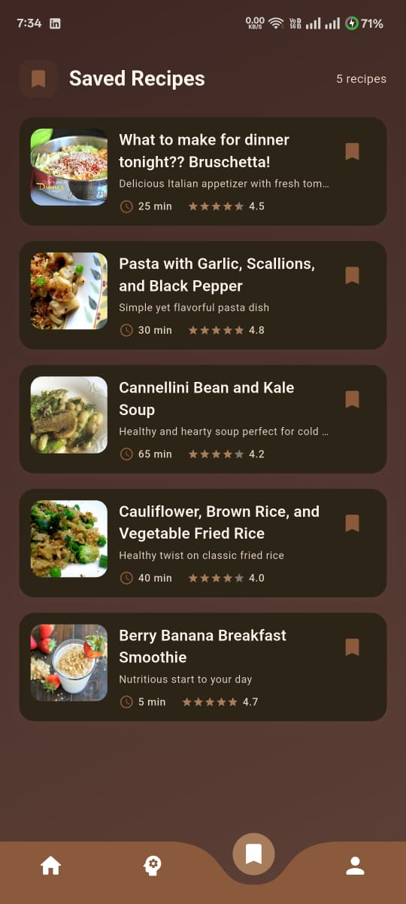
  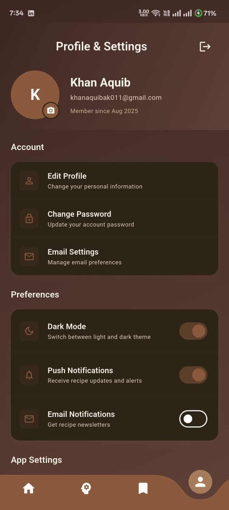
</p>

### 🔔 Notifications
<p>
  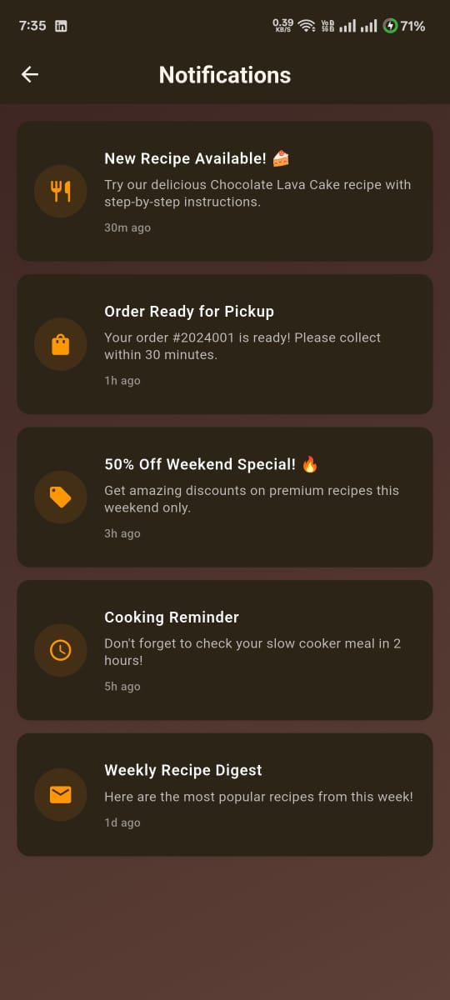
</p>
</details>

--- 

<details>
<summary>🌞 Light Mode</summary>

### 🔐 Auth Screens
<p>
  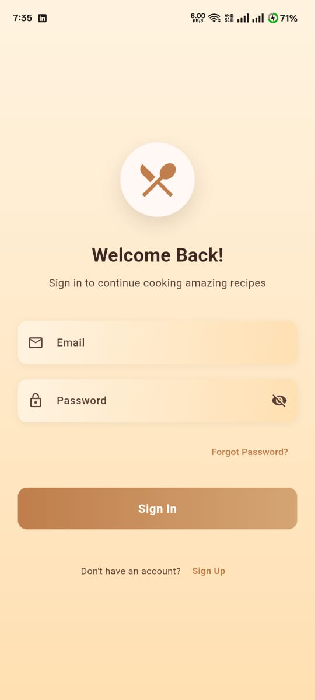
  
  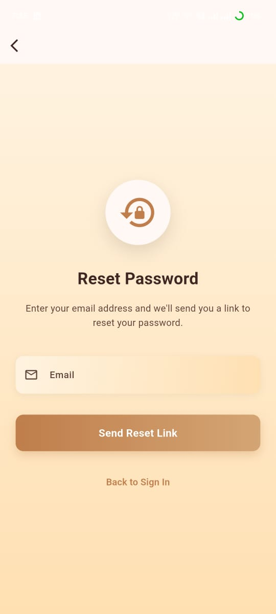
</p>

### 🍲 Recipe Screens
<p>
  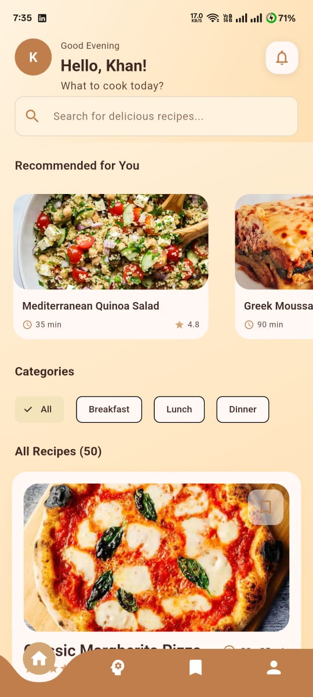
  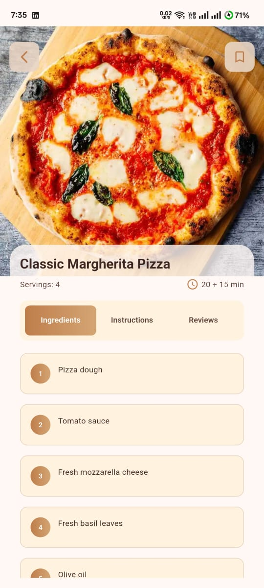
</p>

### 🤖 AI Assistant Screen
<p>
  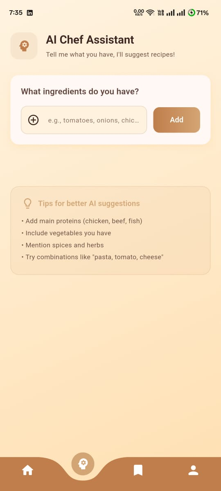
</p>

### 💾 Saved Recipes & Settings
<p>
  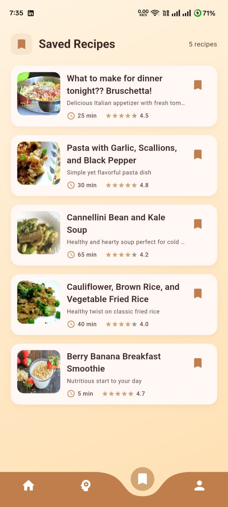
  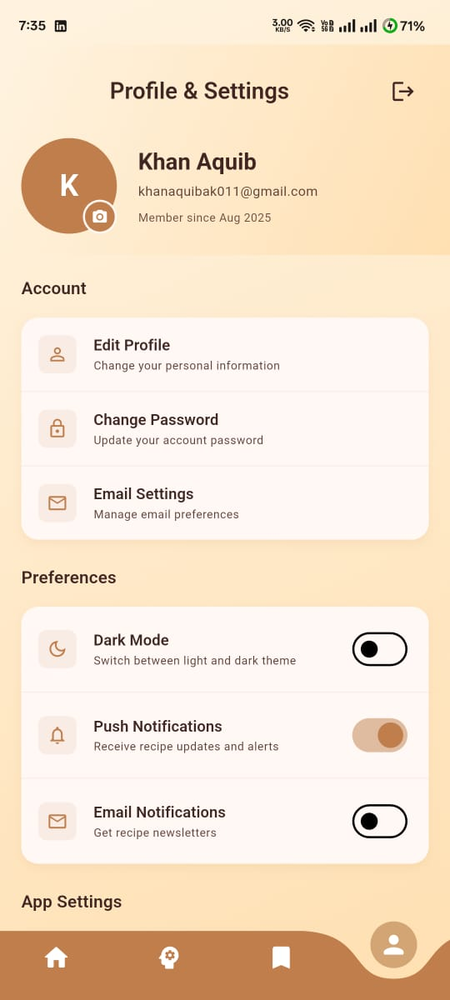
</p>

### 🔔 Notifications
<p>
  
</p>
</details>

---

## 🚀 Getting Started

### ✅ Prerequisites
- Install the **Flutter SDK** and set up your environment  
- An IDE like **Android Studio** or **VS Code**  
- An emulator/simulator or a physical device  

### ✅ Steps to Run
1. **Clone the repository**
   ```bash
   git clone https://github.com/your-username/chef_ai.git
   cd chef_ai
2. **Install dependencies**
   ```bash
   flutter pub get
   ```
3. **(Optional) Verify your setup**
   ```bash
   flutter doctor
   ```
4. **Run the app**
   ```bash
   flutter run
   ```

### 📦 Build (optional)
- **Android (release APK)**
  ```bash
  flutter build apk --release
  ```
- **iOS (release)**
  ```bash
  flutter build ios --release
  ```
  > On macOS with Xcode configured.

---

## 👨‍💻 Author

**Aquib Khan**  
- GitHub: [Aquib-ig](https://github.com/Aquib-ig)  
- LinkedIn: [Aquib Khan](https://www.linkedin.com/in/aquib-khan-454049253)

---
